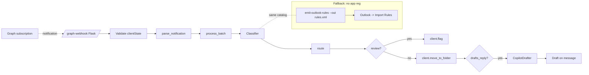

# Outlook Copilot sorter

[](https://github.com/derekgallardo01/outlook-copilot-sorter/actions/workflows/ci.yml) [](LICENSE) [](#) [](https://codespaces.new/derekgallardo01/outlook-copilot-sorter)

**Docs:** [Getting started](docs/getting-started.md) · [Architecture](docs/architecture.md) · [Customization](docs/customization.md) · [Evaluation](docs/evaluation.md) · [Diagrams](docs/diagrams.md) · [FAQ](docs/faq.md)

**Live demo:** [derekgallardo01.github.io/outlook-copilot-sorter](https://derekgallardo01.github.io/outlook-copilot-sorter/) — 12 bundled inbox items classified against the 6-label catalog, routed to folders, drafted where appropriate, regenerated on every push.

**AI-powered Outlook email sorter** with two delivery modes:

1. **Server-side Graph webhook** — classifies mail before it hits
   Outlook. Works on OWA, mobile, and desktop simultaneously. Requires
   Entra app registration.
2. **Client-side Outlook rules** — generates an Outlook-importable
   rules XML for tenants without app-reg access. Works offline; runs
   on Outlook desktop.

Both modes share the same 6-label catalog and folder mapping so a
tenant can start on rules and upgrade to Graph webhook later with
zero re-classification drift.

```bash
pip install -e .
outlook-sorter demo                                    # end-to-end walkthrough
outlook-sorter classify-inbox                          # classify 12 fixtures
outlook-sorter classify-inbox --json                   # machine-readable
outlook-sorter webhook-smoke                           # simulate Graph webhook batch
outlook-sorter emit-outlook-rules --out my-rules.xml   # fallback path
outlook-sorter list-labels                             # show the 6 default classes
```

```bash
python -m pytest -q                                    # 34 unit tests
python evals/run.py                                    # 10 classification cases (19 assertions)
```

Stdlib-only Python on the default path. `flask`, `msgraph-sdk` + `msal`,
and `anthropic` are optional extras.

## Run in Docker

```bash
docker build -t outlook-copilot-sorter .
docker run --rm outlook-copilot-sorter                              # `outlook-sorter demo`
docker run --rm outlook-copilot-sorter pytest -q                    # tests
```

## Example: production scenario

**[examples/graph_webhook_server.py](examples/graph_webhook_server.py)** — Flask receiver for Microsoft Graph change notifications with the full validation handshake + client-state check + classifier + drafter pipeline. Deploy to Azure App Service or Functions; wire a Graph subscription to point at `/graph-webhook`.

```bash
pip install -e ".[webhook]"
python examples/graph_webhook_server.py
```

## The two delivery modes

|                   | Graph webhook | Outlook rules |
|-------------------|:-------------:|:-------------:|
| Server-side       | yes           | no (client)   |
| Requires app reg  | yes           | no            |
| LLM classification available | yes | no (keywords) |
| Draft replies     | yes           | no            |
| Works offline     | no            | yes           |
| Works on OWA/web  | yes           | yes*          |
| Works on mobile   | yes           | partial       |
| Onboarding time   | 30-60 min     | 5 min         |

`*` Outlook rules run on both desktop and OWA when synced.

Both modes route to the **same folders** and share the **same label
catalog**, so a tenant can start on rules (5-min install) and later
upgrade to the Graph webhook without re-training the classifier or
re-labeling folders.

## The 6 default label classes

| Label | Folder | Queue | SLA | Copilot drafts reply? |
|---|---|---|---|:-:|
| `support_ticket` | Support/Inbox | support | 4h | yes |
| `sales_opportunity` | Sales/Inbox | sales | 24h | yes |
| `billing` | Finance/Inbox | finance | 48h | no |
| `internal_hr` | HR/Inbox | hr | 24h | yes |
| `newsletter` | Read-later | (unattended) | - | no |
| `notification` | Notifications | (unattended) | - | no |
| `unknown` | Inbox | human_review | 24h | no |

Edit `DEFAULT_CATALOG` in
[`src/outlook_copilot_sorter/classifier.py`](src/outlook_copilot_sorter/classifier.py)
to add classes, remove classes, or tune the per-class keyword weights.

## Example: what the classifier sees

```
$ outlook-sorter classify-inbox
id     label                 conf folder                 status
------------------------------------------------------------------------------
m-01   support_ticket        1.00 Support/Inbox          DRAFTED
m-02   sales_opportunity     1.00 Sales/Inbox            DRAFTED
m-03   notification          1.00 Notifications          SORTED
m-04   notification          1.00 Notifications          SORTED
m-05   internal_hr           1.00 HR/Inbox               SORTED
m-06   newsletter            1.00 Read-later             SORTED
m-07   sales_opportunity     1.00 Sales/Inbox            DRAFTED
m-08   unknown               0.00 Inbox                  REVIEW
m-09   notification          1.00 Notifications          SORTED
m-10   billing               0.86 Finance/Inbox          SORTED
m-11   unknown               0.00 Inbox                  REVIEW
m-12   support_ticket        0.89 Support/Inbox          DRAFTED
```

10 of 12 messages classify with high confidence; 2 fall to
`unknown` → REVIEW queue (the "Following up" cold-follow-up and the
customer-success check-in — both legitimately ambiguous).

## Architecture



## Wiring to real Microsoft Graph

The `MockGraphClient` class in `src/outlook_copilot_sorter/backend.py`
defines the API surface (`list_inbox`, `move_to_folder`, `flag`).
A production `GraphClient` implementing those methods is ~100 lines of
`msgraph-sdk` + `msal`. See [`docs/customization.md`](docs/customization.md).

## Wiring the Copilot drafter to Microsoft Graph Copilot

The template drafter is deterministic and CI-friendly. To wire real
Microsoft Graph Copilot reply-suggestions:

1. `pip install -e ".[graph]"`
2. `export OUTLOOK_SORTER_DRAFTER=copilot`
3. Provide app-reg credentials + Copilot license
4. Implement `_draft_copilot` in
   [`src/outlook_copilot_sorter/copilot_drafter.py`](src/outlook_copilot_sorter/copilot_drafter.py)
   per the docstring sketch (~30 lines)

See [`docs/customization.md`](docs/customization.md).

## What's inside

| Path | Purpose |
|---|---|
| `src/outlook_copilot_sorter/classifier.py` | 6-label catalog + rule/keyword classifier + confidence-thresholded router |
| `src/outlook_copilot_sorter/copilot_drafter.py` | Substitution + Copilot backends, tone-tagged templates |
| `src/outlook_copilot_sorter/graph_webhook.py` | Graph change-notification parser + batch processor |
| `src/outlook_copilot_sorter/outlook_rules.py` | Client-side rules XML generator (fallback path) |
| `src/outlook_copilot_sorter/backend.py` | `MockGraphClient` + 12-message fixture inbox |
| `src/outlook_copilot_sorter/cli.py` | `classify-inbox / webhook-smoke / emit-outlook-rules / list-labels / demo` |
| `examples/graph_webhook_server.py` | Flask receiver for production Graph webhooks |
| `tests/` | 34 pytest tests across classifier + drafter + webhook + rules |
| `evals/golden.json` | 10 per-message cases (19 assertions) |
| `evals/run.py` | Eval harness |
| `pyproject.toml` | Package + `outlook-sorter` script entry |

## Companion repos

- [email-triage-automation](https://github.com/derekgallardo01/email-triage-automation) — the broader inbox-triage kit this specializes on. Use that one for IMAP + non-Outlook stacks; use this one specifically for Outlook + Copilot.
- [prompt-registry-kit](https://github.com/derekgallardo01/prompt-registry-kit) — version the reply-draft templates + A/B-test tone with eval-gated promotion.
- [llm-observability-kit](https://github.com/derekgallardo01/llm-observability-kit) — wrap the Copilot drafter's LLM call in `@trace` to capture cost + latency + per-label draft-rate.
- [graph-automation-scripts](https://github.com/derekgallardo01/graph-automation-scripts) — companion admin scripts (license audit, MFA gaps) for the same M365 tenant.
