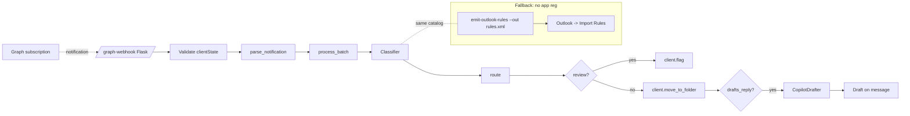
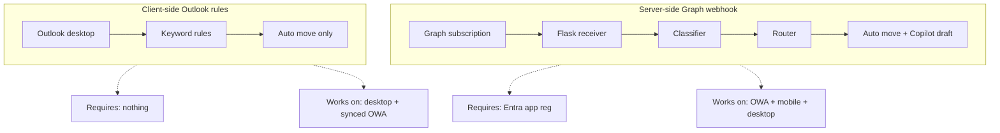
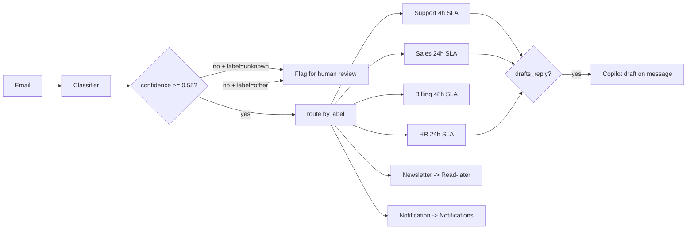

# Diagrams

## System flow

```mermaid
flowchart LR
    G[Graph subscription] -.notification.-> WH[/graph-webhook Flask/]
    WH --> V[Validate clientState]
    V --> P[parse_notification]
    P --> PB[process_batch]
    PB --> CL[Classifier]
    CL --> R[route]
    R --> RE{review?}
    RE -->|yes| FL[client.flag]
    RE -->|no| MV[client.move_to_folder]
    MV --> DR{drafts_reply?}
    DR -->|yes| D[CopilotDrafter]
    D --> M[Draft on message]
    subgraph fallback["Fallback: no app reg"]
      OR[emit-outlook-rules --out rules.xml]
      OR --> IMP[Outlook -> Import Rules]
    end
    CL -.same catalog.- OR
```

## Delivery mode comparison

```mermaid
flowchart TB
    subgraph mode1["Server-side Graph webhook"]
      W[Graph subscription] --> S[Flask receiver]
      S --> C1[Classifier]
      C1 --> R1[Router]
      R1 --> A1[Auto move + Copilot draft]
    end
    subgraph mode2["Client-side Outlook rules"]
      X[Outlook desktop] --> KW[Keyword rules]
      KW --> A2[Auto move only]
    end

    mode1 -.-> P1[Requires: Entra app reg]
    mode1 -.-> P2[Works on: OWA + mobile + desktop]
    mode2 -.-> Q1[Requires: nothing]
    mode2 -.-> Q2[Works on: desktop + synced OWA]
```

## Confidence-thresholded routing

```mermaid
flowchart LR
    E[Email] --> CL[Classifier]
    CL --> CONF{confidence >= 0.55?}
    CONF -->|no + label=unknown| RV[Flag for human review]
    CONF -->|no + label=other| RV
    CONF -->|yes| ROUTE[route by label]
    ROUTE --> S[Support 4h SLA]
    ROUTE --> SA[Sales 24h SLA]
    ROUTE --> B[Billing 48h SLA]
    ROUTE --> HR[HR 24h SLA]
    ROUTE --> NL[Newsletter -> Read-later]
    ROUTE --> NF[Notification -> Notifications]

    S --> D1{drafts_reply?}
    SA --> D1
    HR --> D1
    D1 -->|yes| DR[Copilot draft on message]
```
