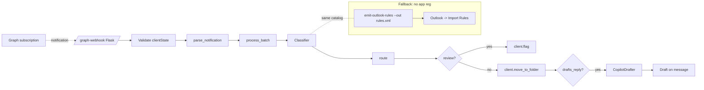
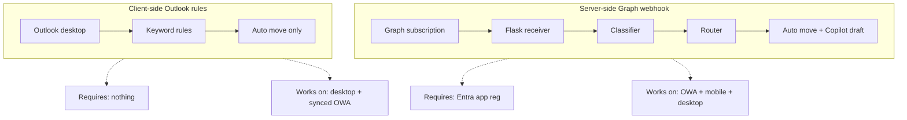
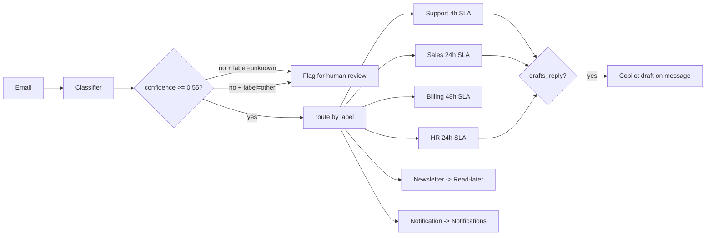
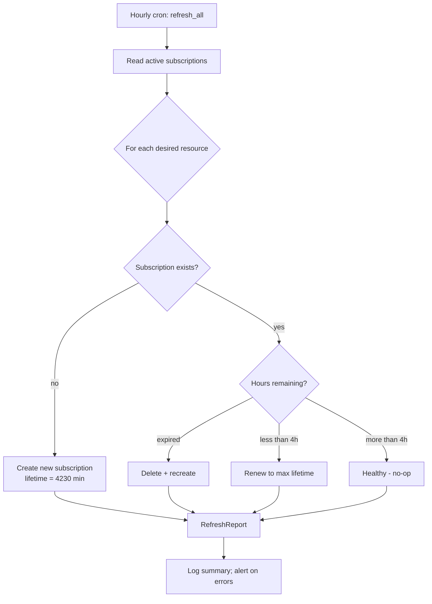
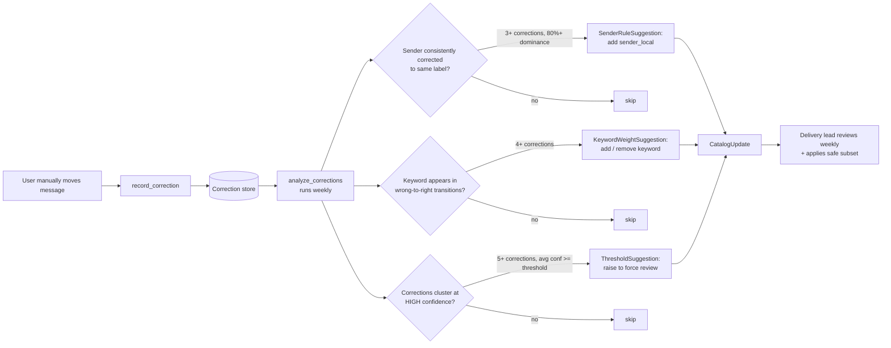

# Diagrams

## System flow

```mermaid
flowchart LR
    G[Graph subscription] -.notification.-> WH[/graph-webhook Flask/]
    WH --> V[Validate clientState]
    V --> P[parse_notification]
    P --> PB[process_batch]
    PB --> CL[Classifier]
    CL --> R[route]
    R --> RE{review?}
    RE -->|yes| FL[client.flag]
    RE -->|no| MV[client.move_to_folder]
    MV --> DR{drafts_reply?}
    DR -->|yes| D[CopilotDrafter]
    D --> M[Draft on message]
    subgraph fallback["Fallback: no app reg"]
      OR[emit-outlook-rules --out rules.xml]
      OR --> IMP[Outlook -> Import Rules]
    end
    CL -.same catalog.- OR
```

## Delivery mode comparison

```mermaid
flowchart TB
    subgraph mode1["Server-side Graph webhook"]
      W[Graph subscription] --> S[Flask receiver]
      S --> C1[Classifier]
      C1 --> R1[Router]
      R1 --> A1[Auto move + Copilot draft]
    end
    subgraph mode2["Client-side Outlook rules"]
      X[Outlook desktop] --> KW[Keyword rules]
      KW --> A2[Auto move only]
    end

    mode1 -.-> P1[Requires: Entra app reg]
    mode1 -.-> P2[Works on: OWA + mobile + desktop]
    mode2 -.-> Q1[Requires: nothing]
    mode2 -.-> Q2[Works on: desktop + synced OWA]
```

## Confidence-thresholded routing

```mermaid
flowchart LR
    E[Email] --> CL[Classifier]
    CL --> CONF{confidence >= 0.55?}
    CONF -->|no + label=unknown| RV[Flag for human review]
    CONF -->|no + label=other| RV
    CONF -->|yes| ROUTE[route by label]
    ROUTE --> S[Support 4h SLA]
    ROUTE --> SA[Sales 24h SLA]
    ROUTE --> B[Billing 48h SLA]
    ROUTE --> HR[HR 24h SLA]
    ROUTE --> NL[Newsletter -> Read-later]
    ROUTE --> NF[Notification -> Notifications]

    S --> D1{drafts_reply?}
    SA --> D1
    HR --> D1
    D1 -->|yes| DR[Copilot draft on message]
```

## Subscription lifecycle (hourly cron)

```mermaid
flowchart TB
    START[Hourly cron: refresh_all] --> LIST[Read active subscriptions]
    LIST --> LOOP{For each desired resource}
    LOOP --> M{Subscription exists?}
    M -->|no| C[Create new subscription<br/>lifetime = 4230 min]
    M -->|yes| E{Hours remaining?}
    E -->|expired| D[Delete + recreate]
    E -->|less than 4h| R[Renew to max lifetime]
    E -->|more than 4h| H[Healthy - no-op]
    C --> REP[RefreshReport]
    D --> REP
    R --> REP
    H --> REP
    REP --> LOG[Log summary; alert on errors]
```

## Learn-from-moves feedback loop

```mermaid
flowchart LR
    USER[User manually moves message] --> RC[record_correction]
    RC --> STORE[(Correction store)]
    STORE --> ANALYZE[analyze_corrections<br/>runs weekly]

    ANALYZE --> SR{Sender consistently corrected<br/>to same label?}
    SR -->|3+ corrections, 80%+ dominance| SR_YES[SenderRuleSuggestion:<br/>add sender_local]
    SR -->|no| SR_NO[skip]

    ANALYZE --> KW{Keyword appears in<br/>wrong-to-right transitions?}
    KW -->|4+ corrections| KW_YES[KeywordWeightSuggestion:<br/>add / remove keyword]
    KW -->|no| KW_NO[skip]

    ANALYZE --> T{Corrections cluster at<br/>HIGH confidence?}
    T -->|5+ corrections, avg conf >= threshold| T_YES[ThresholdSuggestion:<br/>raise to force review]
    T -->|no| T_NO[skip]

    SR_YES --> CU[CatalogUpdate]
    KW_YES --> CU
    T_YES --> CU
    CU --> REVIEW[Delivery lead reviews weekly<br/>+ applies safe subset]
```
